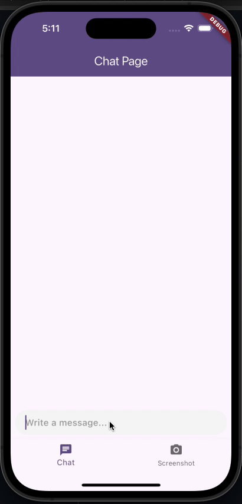

# Flutter AI Chat with Image Analysis

A Flutter app that combines AI chat functionality with screen image analysis using the Anthropic API.

## Demo

## Supported Features

- [x] AI-powered chat interface
- [x] Screen screenshot capability
- [x] AI analysis of screenshot content
- [x] Integration with Anthropic API for request processing

## App Architecture

The app is composed of three main layers:

### Data Layer
This layer contains the `AnthropicService` that interacts with the Anthropic API to process chat messages and analyze images.

### Application Layer
This layer manages the state and business logic of the app, including:
- Chat message handling
- Screenshot capture and processing
- Integration between UI interactions and the data layer

### Presentation Layer
This layer contains all the widgets that make up the user interface, including the chat screen and screenshot functionality.

## Packages in Use

- `dash_chat_2` for the chat UI
- `anthropic_sdk_dart` for Anthropic API integration
- `screenshot` for capturing screen images
- `flutter_riverpod` for state management

